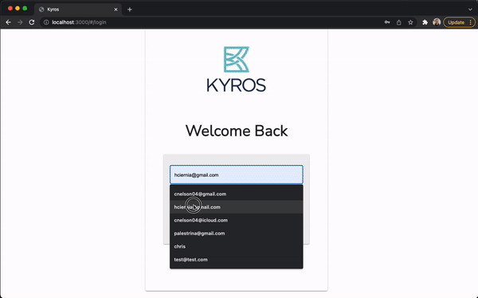

 

# Kyros- Exam & Proctor

## Table of Contents

- [Description](#description)
- [Screenshots](#screenshots)
- [Built With](#built-with)
- [Getting Started](#getting-started)
  - [Prerequisites](#prerequisites)
  - [Installation](#installation)
- [Usage](#usage)
- [License](#license)
- [Acknowledgements](#acknowledgements)
- [Contacts](#contacts)

## Description

Kyros - Kyros helps those on their recovery journey track progress, celebrate accomplishments, find support and demonstrate their credibility 

Minnesota Certification Board (MCB) - MCB sets the policies and procedures for various certifications needed in the world of Substance Use Disorder (SUD)

Those In Recovery - Those in recovery who are far along enough in their journey, but do not have access to necessary resources

This Application - Helps counselors and staff within the rehabilitation community achieve their certification goals as they work to support participants in the organanizations they serve. 

## Screenshots

## Built With

## Getting Started

Please fully review the Readme.md file before installing and running this application

To successfully load this application, core developer tools will be helpful. Consider installing git, npm, Postgres, node and a modern code editor. 

This application is designed to work on Chrome. Other browsers may work, but have not been tested. 

### Prerequisites

An npm install is the easiest way to address any required installations and ensure the latest versions of packages in place before launching the application. 

If individual installs is preferred, please refer the dependencies section of the package.json file included in the root software directory file.

### Installation

This software solution is dependent on several third party services, API's, hosting and storage. They include, but are not limited to Material-UI, Axios, Amazon Web Services, React and others.

## Usage

This application is designed to facilitate virtual examinations as students look to achieve the certificates necessary to council at Kyros and other rehabilitation and drug addiction facilities. The application also provides capabilities for a proctor to be present throughout the examination process. 

## License

<a href="https://choosealicense.com/licenses/mit/">MIT License</a>

## Acknowledgements

We wish to acknowledge Prime Digital Academy, the Ionian Cohort and our instructor Dev Janna in providing a challenging and supportive learning environment throughout this program. 

Also, a big thank you to Kyros for bringing us the opportunity to learn through collaborating on this project with you. We appreciate your trust and patience as we worked to bring this idea to life. 

Finally, the biggest thank you to our friends and family members that have supported and sustained us through the Prime Journey. 